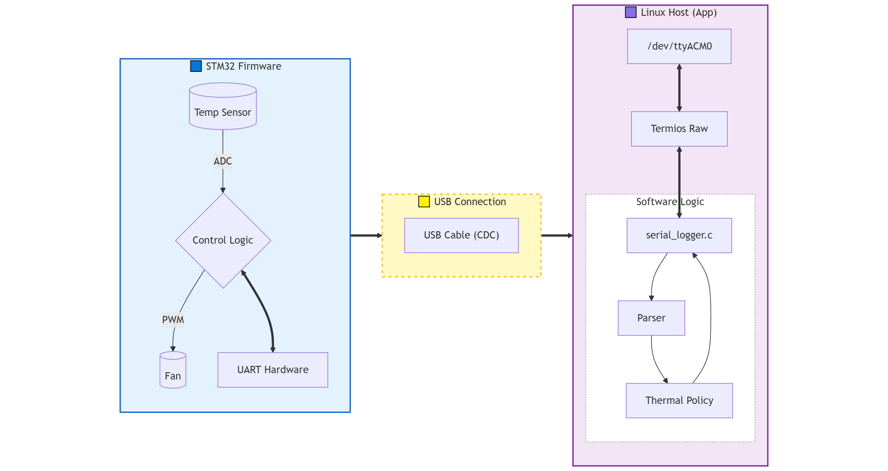

# Mini BMC Thermal Management System (Linux & STM32)

## 📖 Project Overview
這是一個模擬伺服器 **BMC (Baseboard Management Controller)** 熱管理的嵌入式系統專案。
系統由 **STM32 (Firmware)** 負責硬體監控與 PWM 風扇模擬，並透過 USB (Virtual COM Port) 與 **Linux Host** 進行通訊。
Linux 端實作了 User-space Driver，負責解析二進位封包、執行熱控策略 (Thermal Policy)，並透過閉迴路機制控制硬體。

## 🏗️ System Architecture


## 🛠️ Tech Stack
* **Hardware**: STM32F4 Nucleo (UART, ADC, TIM PWM, GPIO)
* **OS / Environment**: Linux (Ubuntu on WSL2)
* **Language**: C (POSIX Standard)
* **Key Techniques**:
    * **IPC**: UART Communication (Termios Raw Mode)
    * **Protocol**: Custom Binary Protocol with Checksum
    * **Architecture**: Host-Client Pattern, Modular Design
    * **Testing**: Mock Unit Testing (No-hardware verification)

## 🚀 Key Features
1.  **Bi-directional Communication**: 雙向通訊協定，支援數據回報與控制指令下發。
2.  **Closed-Loop Thermal Control**:
    * Temp > 50°C: Trigger High-Speed Cooling Mode ('H' command).
    * Temp < 20°C: Trigger Silent Mode ('L' command).
3.  **Robustness**: 實作 `SIGINT` (Ctrl+C) 訊號攔截，確保 File Descriptor 安全關閉。
4.  **Unit Testing**: 內建 `parser.c` 邏輯的單元測試，可於無硬體環境下驗證通訊協定正確性。

## 📂 Project Structure
* `firmware/`: STM32CubeIDE Project source code.
* `linux_app/`: Linux C driver and application logic.
* `tests/`: Unit tests for protocol parsing logic.

## 🔧 How to Run
1.  **Build the Linux App**:
    ```bash
    cd linux_app
    gcc serial_logger.c parser.c -o serial_logger
    ```
2.  **Run System**:
    ```bash
    sudo ./serial_logger
    ```
3.  **Run Tests**:
    ```bash
    cd ../tests
    gcc test_parser.c ../linux_app/parser.c -o test_runner
    ./test_runner
    ```

## 💡 Technical Highlights
* **Raw Mode UART Communication**
  Configured Linux Termios in raw mode to ensure binary data transmission without OS-level interference.
* **Robust Protocol Parser**
  Implemented header validation and checksum verification to prevent data corruption caused by UART noise.
* **Mock-based Unit Testing**
  Designed unit tests for protocol parsing logic, enabling hardware-independent verification and CI/CD integration.

## 🚀 Future Roadmap
* **Kernel-space Driver Migration**
  Currently, UART communication is handled in user space for rapid development and debugging. Future plans include migrating the core communication logic into a Linux kernel-space character device driver, leveraging interrupt-driven I/O to reduce CPU usage and improve system scalability.